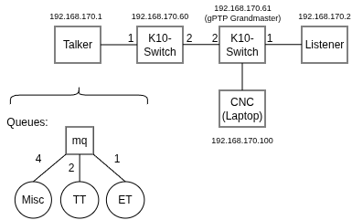

# Physical Testbed Benchmarks

This document describes how to reproduce the results from Section VI.A _Physical Testbed Benchmarks_ of the paper _An (m, k)-firm Elevation Policy for Weakly Hard  Real-Time in Converged 5G-TSN Networks_. For more context please refer to this document: https://doi.org/10.5281/zenodo.19224732

## Setup

We use the inverted pendulum from [1] as a basis and adapted the source code. The sender and receiver are connected via two TSN-switches (Kontron KSwitch D10 MMT series). The configuration files for these switches are in the `/configs` folder. To flash the two Teensy microcontrollers, follow the instructions in `/pendulum_code/sender-receiver-teensy/README.md`. To compile both C++ applications (sender and receiver), follow the steps in `/pendulum_code/sender-receiver-linux/README.md`.



## Execution
To start a complete run with 15 min runtime for each (1,k)-firm configuration, do the following steps:

### Start PTP on Sender and Receiever

```shell
$ ./configs/timesync start
```

### Start Linux Receiver

```shell
$ ./configs/sender.sh
$ cd pendulum_code/sender-receiver-linux/cmake-buil-debug
$ ./pendulum_receiver ../Config/receiver_mlqr.json
```

### Start Linux Sender

```shell
$ ./configs/receiver.sh`
$ cd pendulum_code/sender-receiver-linux/cmake-buil-debug
$ ./pendulum_sender s ../Config/sender_et-tt_run15min.json
```


## Evaluation

We evaluated four independent runs. The data files for each run are located in different folders within the `results/15min` directory. Every run generated for each configuration a file `pendulumsender_et-tt90_*.json`. The provided script `maximum_median_angle.py` extracts  and plots the median and maximum values for each configuration across all four runs.

## References

[1] R. Laidig, J. Herrmann, D. Augustat, F. Dürr, and K. Rothermel, “Combining dynamic deterministic latency bounds and networked control systems,” in 2024 IEEE International Performance, Computing, and Communications Conference (IPCCC), 2024, pp. 1–9., DOI: 10.1109/IPCCC59868.2024.10850021

